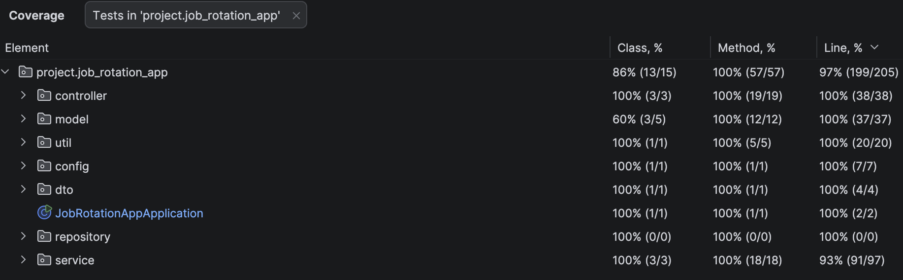

# Next Step - Job Rotation Application

Work based report module project encompassing career development and rotation resources, hosting internal role opportunities available within the Next Step application.

To run the application execute the following commands:

1. /job-rotation-app/job-rotation-app-backend

```bash
./gradlew bootRun
# to run the application
```

2. /job-rotation-app/job-rotation-app-frontend

```bash
npm run dev
# open and launch the development environment in a browser https://localhost:5173
```

## Frontend Development Tools

1. TypesScript
2. Boostrap
3. React

## Backend Development Tools

1. Java
2. SpringBoot
3. MySQL Database

## Frontend

The frontend consists of multiple screens aimed for employee and staffing manager end users.

To run the frontend application by itself:

```bash
npm run dev
# open and launch the development environment in a browser https://localhost:5173
```

```bash
npm install
# install all project dependencies
```

```bash
npm audit fix
# address vunerabilites of dependencies issues
```

### Pages Implemented

- Employee Landing Page
- Resource Pages: staffing manager contact list, express interest, GTD support, people support, FAQs, rotation process
- Staffing Manager Landing Page
- Create Role
- Update Role
- Delete Role
- Data Charts

## Backend

The backend consists of several APIs implemented to carry out the data exchange functionalties required. Refer to the `openApiSpec.yml` file within the job-rotation-app-backend directory to view all APIs implemented with their responses, parameters and data expected. Unit tests have been created to validate functionalitis of all APIs developed.

To run the backend application itself:

```bash
./gradlew bootRun
# to run the application
```

```bash
./gradlew build
# to build the application and its dependencies
```

```bash
./gradlew test -i
# to run backend tests
```

### Backend Tests

Unit tests implemented for the backend can be located at - job-rotation-app-backend/src/test/java/project/job_rotation_app

### Test Coverage
- Overall project test coverage = 86%
- Methods test coverage = 100%
- Lines test coverage = 94%+
- To obtain the below results in IntelliJ IDE, run tests with coverage for the directory `job-rotation-app-backend/src/test/java/project/job_rotation_app` and view in 'Coverage' tab.


### Security and Authentication 

JWT (JSON Web Tokens) has been implemented alongisde the authentication mechniasm to securely manager staffing manager login and protect API backend endpoints
- User logins, credentials authenticated and a JWT token is generated.
- Secure - ensures sensitive user data isn't stored on the server between requests.
- JWT stored in a cookie - prevents JavaScript from accessing the cookie, preventing XSS (Cross-Site Scripting) attacks.

BCrypt Hashing has been utilised for password storage, in the database user passwords are hashed before being inserted into the database. This ensures plain text passwords are not stored and follows best practices to ensure user credentials remain protected.
- For testing purposes, the passwords for the staffing manager users is 'pass'.
- https://bcrypt.online/ : used to hash plain text passwords before being added to the database.

## Database

1. Install MySQL Workbench
2. Create a database connection with connection name: 'job_rotation_db', port: 3306, username: root, password: new_password, and hostname: 127.0.0.1
3. Create a schema named job_rotation_db.
4. Run .gradlew bootRun within the job-rotation-app-backend directory to spin up the backend - this will create the necessary tables required for the application.
5. Update the table using the ALTER SQL statements.
6. Execute the INSERT SQL statements within the 'data.sql' file in MySQL workbench for data to use while running the application.

## Troubleshoot

- Data not rendering? - ensure the backend is running before running the frontend
- Issues in data truncation error appearing? - truncate the roles and staffing_managers tables to be emptied. Rerun the backend and add in the SQL statements from data.sql
